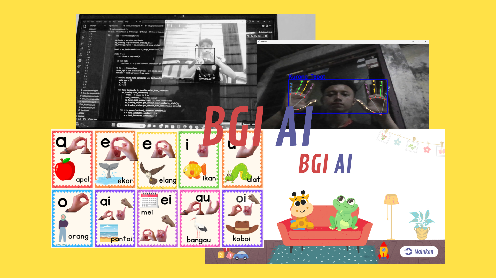

# 🎓 **BGI AI - Pembelajaran Anak Kinestetik Berbasis Teknologi AI**

## 📝 **Deskripsi Proyek**
<div align="justify">

**BGI AI** adalah sebuah interface yang dirancang khusus untuk mendukung pembelajaran anak kinestetik. Proyek ini mengintegrasikan teknologi **Computer Vision** dan **Speech Recognition** untuk menciptakan pengalaman belajar yang interaktif, adaptif, dan menyenangkan. Teknologi ini memungkinkan anak untuk belajar melalui gerakan tubuh dan interaksi verbal, sehingga sesuai dengan gaya belajar anak kinestetik yang lebih responsif terhadap aktivitas fisik dan stimulasi multisensorik.

</div>

## 🌟 **Fitur Utama**
1. **Computer Vision untuk Gerakan** 🕺  
   - Mendeteksi dan memahami gerakan dan bentuk tangan anak.  
   - Memberikan umpan balik real-time untuk aktivitas fisik seperti olahraga atau permainan edukatif.  

2. **Speech Recognition untuk Interaksi Verbal** 🎤  
   - Mengenali dan memahami suara anak dalam menyebutkan huruf.  
   - Mendukung dialog interaktif untuk meningkatkan kemampuan komunikasi verbal.  

3. **Interface BGI AI yang User-Friendly** 🖥️  
   - Desain intuitif untuk anak-anak.  
   - Mendukung pembelajran berbasis game yang menyenangkan.


## 📂 **Struktur Direktori**
```plaintext
.
├── Notebook/             # beberapa skrip untuk eksperimen dan inferensi
├── docs/                 # Dokumentasi teknis dan manual pengguna
├── README.md             # Dokumentasi proyek

```

## 🛠️ **Beberapa tools yang Digunakan**

### 📷 **Computer Vision**
- OpenCV  
- MediaPipe  

### 🎙️ **Speech Recognition**
- Hugging Face Models (Wav2Vec2)

### 🤖 **Framework AI**
- TensorFlow  
- Scikit-learn  

### 🐍 **Bahasa Pemrograman**
- Python  

### 🖥️ **Interface Development**
- Tkinter

## 🖥️ **Berikut adalah cuplikan kecil dari interface proyek ini**


